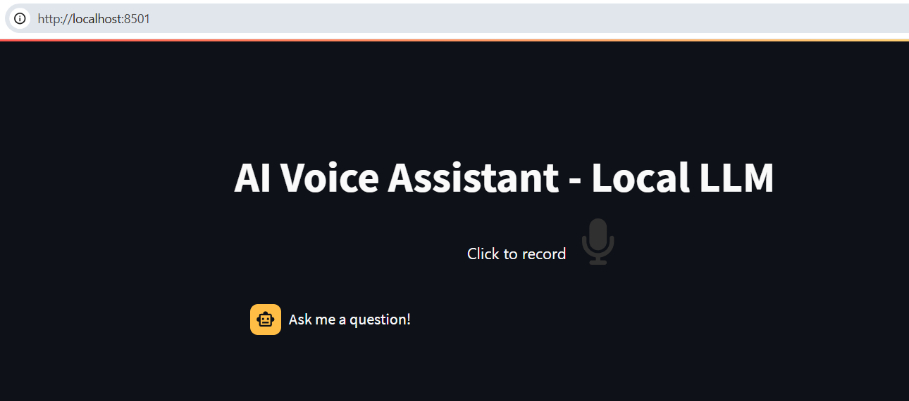

# AI-Voice-Assistant-Local-LLM
Aim of this project is to create a voice assistant that runs inference with 100% local LLM

# Tech Stack
1. Streamlit
2. LLama
3. STT
4. TTS
5. Docker

# Simple and Quick way to run a voice assistant
1. Docker installed in your machine
2. Docker pull rajamarthala/ai-assitant-finnish:3b , pulls the image of streamlit app UI
3. Docker compose up , pulls the ollama image and runs the both container ollama and streamlit
4. docker exec -it ai-voice-assistant-local-llm-ollama-container-1 ollama run modelname (llama3.2:1b in this case), it downloads the model and saves to the /data/ollama folder

